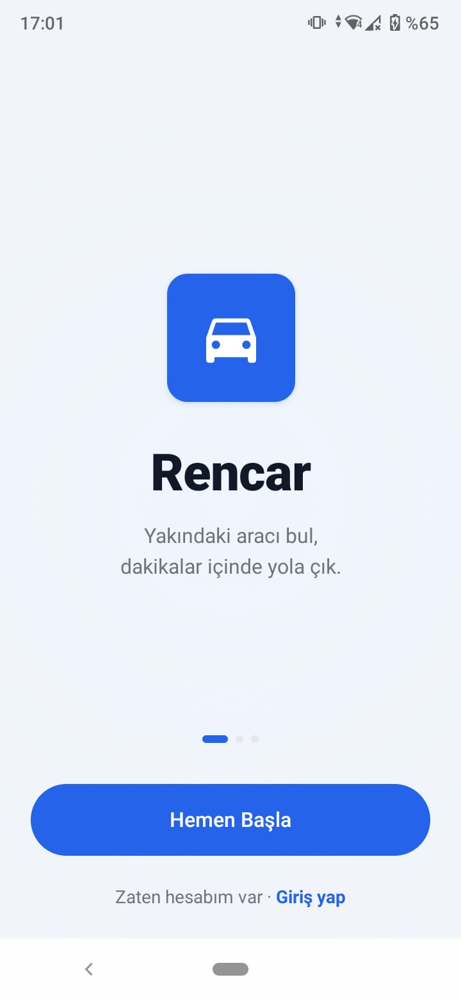
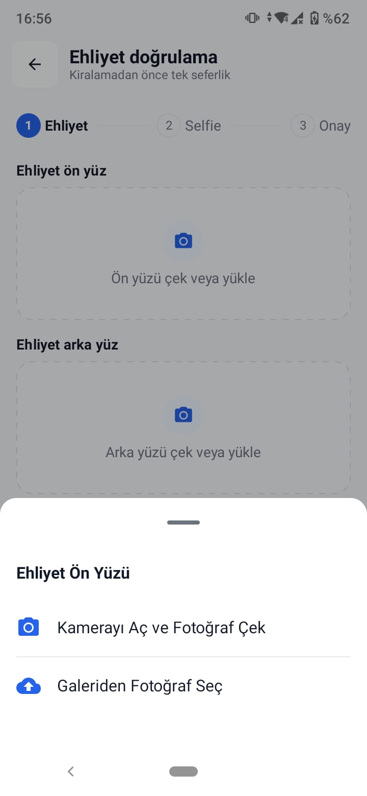
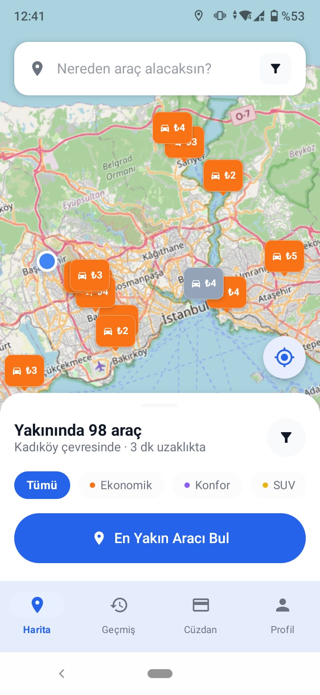
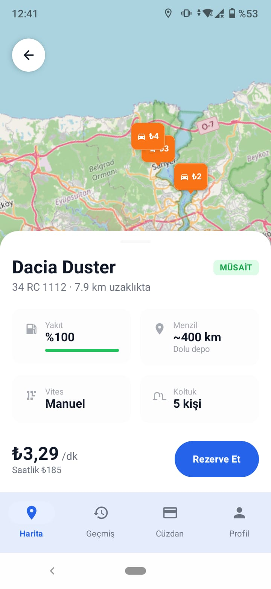
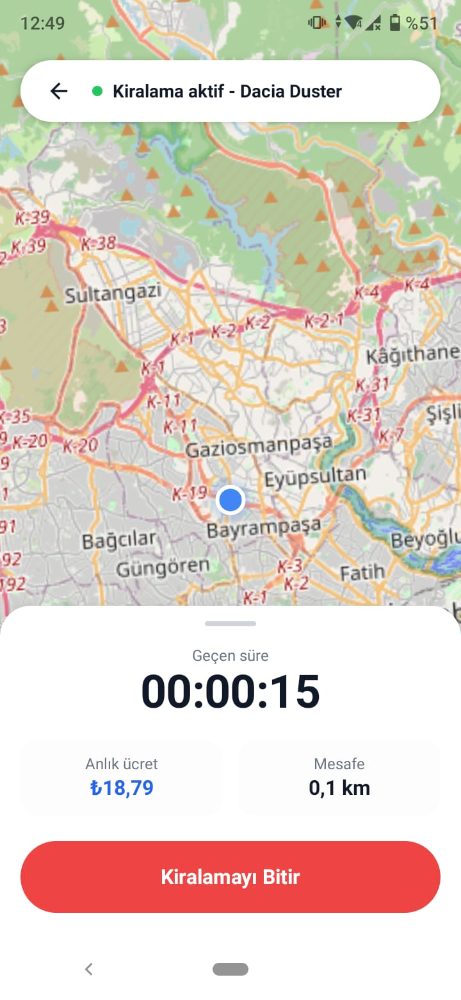
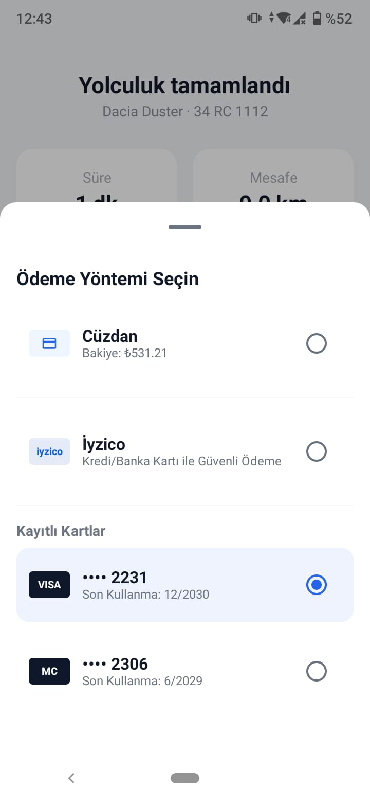
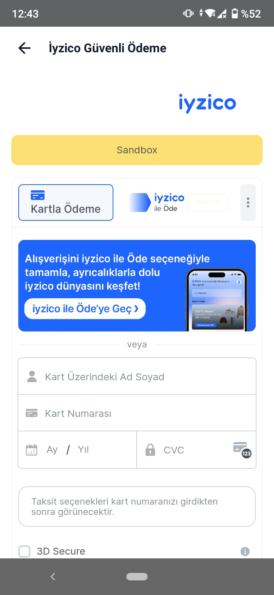
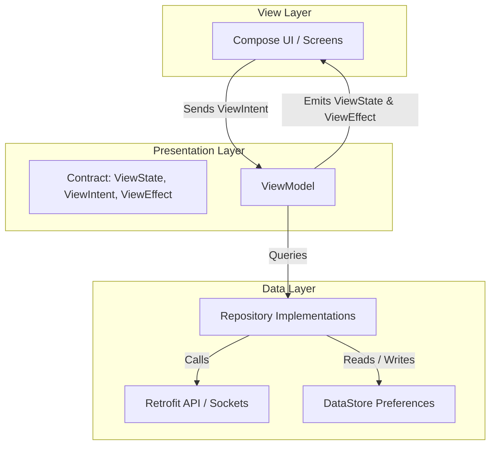

# renCar App - Car Rental Mobile Application

renCar App is a modern, feature-rich car rental mobile application built natively for Android using Jetpack Compose and Kotlin. Designed with clean architecture boundaries and robust patterns, the application delivers a premium user experience featuring real-time map integrations, secure payment methods, and live location tracking via WebSockets.

<p align="center">
  
  
  
  
  
  
  
</p>

## Key Features

### 1. Authentication and JWT Session Management
* Supports secure User Registration and Login.
* OTP Verification acts as the primary access gate during the login flow.
* Automatically refreshes and persists JWT authentication tokens (AccessToken and RefreshToken) securely in local storage.
* An OkHttp interceptor appends JWT headers automatically to outgoing Retrofit network requests.

### 2. Driver's License and Identity Verification
* Integrates `/license/upload` and `/license/status` APIs for submitting and checking driver's license status.
* Utilizes native photo gallery access for quick image previews.
* Displays guided steps including a selfie placeholder to ensure driver compliance.

### 3. Dynamic Map and Vehicle Fleet Explorer
* Features an interactive map visualization powered by MapLibre Native SDK (v11.7.1) for listing nearby cars.
* Utilizes a standardized light theme using OpenStreetMap styles, guaranteeing high contrast and readability regardless of the device's dark/light settings.
* Renders available vehicles as interactive annotations with real-time price tags.
* Filters vehicles in real-time by category (Economic, Comfort, SUV) directly synchronized via the backend api.

### 4. Booking Flow and Pre-Rental Inspections
* Prompts users to capture and upload 4-angle vehicle photos (Front, Rear, Left, Right) to record pre-rental vehicle status.
* Includes an interactive approval dialog where users confirm pricing, terms, and insurance packages before submitting to `/reservations`.

### 5. Active Rental and WebSocket Tracking
* Connects to `/ws/locations` via Socket.IO, listening to the `my-vehicle` event for real-time telemetry updates.
* Displays elapsed time, total distance traveled, and current calculated rental costs dynamically.

### 6. Flexible Payment Gateways
* Allows users to check balances, pay with their internal virtual wallet (`WALLET` method), and view recent transactions in their wallet history.
* Integrates the secure Iyzico Checkout payment method (`IYZICO` method) which initializes the transaction, spawns a full-screen native Android WebView to render the Iyzico form, intercepts redirects to grab session tokens, and executes final payment verifications.

### 7. Custom Rental History and Analytics
* Displays monthly statistics, expenditure charts, and distance highlights.
* Uses Compose Canvas to dynamically draw clean, high-performance paths representing the journey route for each historical rental item.


## Architecture and Patterns

The application conforms strictly to MVI (Model-View-Intent) presentation patterns combined with Clean Architecture boundaries.



### Unidirectional Data Flow (UDF)
Each screen is divided into a Stateless Screen (handling previews and inputs) and a Stateful Screen (handling state bindings). All presentation contracts are defined within `ui/contract` under three blocks:
1. **ViewState (State)**: A single data class representing the complete visual state of the screen at any given time.
2. **ViewIntent (Intent)**: Sealed classes capturing all possible user actions (such as clicking a button or selecting a tab).
3. **ViewEffect (Effect)**: Sealed classes capturing one-off asynchronous side effects (such as navigating to another screen or displaying a Toast).


## Technology Stack

| Component | Library / Framework |
| :--- | :--- |
| **Language** | Kotlin |
| **Minimum SDK** | API Level 24 (Android 7.0) |
| **Compile/Target SDK** | API Level 36 (Android 14+) |
| **UI Framework** | Jetpack Compose (Material 3) |
| **DI Engine** | Dagger Hilt |
| **Asynchronous API** | Kotlin Coroutines and Flow |
| **Network Client** | Retrofit and OkHttp |
| **JSON Serialization** | kotlinx.serialization |
| **Persistent Storage** | Jetpack DataStore (Preferences) |
| **Maps SDK** | MapLibre Native SDK for Android |
| **Realtime Telemetry** | Socket.IO Client |


## Project Directory Structure

```text
app/src/main/java/com/turkcell/rencarapp/
│
├── MainActivity.kt           # Entry Component / Theme Preference setup
├── RenCarApplication.kt      # Application initialization and Hilt Setup
│
├── data/                     # Data Infrastructure Layer
│   ├── auth/                 # Auth DTOs, API Interfaces, Repositories
│   ├── license/              # Driver License API and Repository
│   ├── vehicle/              # Fleet explorer & details API
│   ├── reservation/          # Reservation state and photo upload API
│   ├── rental/               # Active rental & socket handling
│   ├── payment/              # Wallet, Transactions & Iyzico processing
│   └── preferences/          # DataStore persistent settings (Theme, Auth data)
│
├── di/                       # Dagger Hilt Modules
│   ├── NetworkModule.kt      # Retrofit, OkHttp, Kotlinx Serialization module
│   ├── AuthModule.kt         # Auth bindings
│   ├── ReservationModule.kt  # Booking bindings
│   └── ...                   # Other DI bindings
│
└── ui/                       # UI Layer
    ├── theme/                # Color, Theme & Typography tokens (Dynamic Color disabled)
    ├── navigation/           # NavHost, Routes & Screen Transitions
    ├── contract/             # MVI Contracts (ViewState, ViewIntent, ViewEffect)
    ├── screens/              # Jetpack Compose Screens (Welcome, Login, Active Rental, etc.)
    └── components/           # Reusable Compose custom views
```


## Getting Started and Setup

### Prerequisites
* Android Studio (Koala or later recommended)
* JDK 17+ (Java 11 compatible bytecode)
* Android SDK 36 (Target) / Android SDK 24 (Minimum)

### Build and Run
1. **Clone the Repository**:
   ```bash
   git clone <repository_url>
   cd renCarApp
   ```
2. **Sync Project**:
   Open the project directory in Android Studio. Gradle will automatically sync and download all dependencies listed in `build.gradle.kts` and `gradle/libs.versions.toml`.

3. **Deploy**:
   Run the `app` configuration on a physical device or an Android emulator.


## Architectural Decisions Reference

For comprehensive technical insights, historical changes, and developer guidelines, please refer to the design decision records:
* **[docs/decisions.md](docs/decisions.md)**: Details color mappings, navigation decisions, MVI contract designs, DataStore configuration, MapLibre version updates, Socket.IO configurations, and Payment implementation notes.
* **[AGENTS.MD](AGENTS.MD)**: Contains developer guidelines, limitations, and formatting rules.
